# 🍴 Naman Restaurant – Smart Restaurant Management Web App

A **modern full-stack restaurant management platform** built with **Django**, empowering customers to discover restaurants, explore menus, place and track orders, while allowing restaurant owners to manage their menus, deals, insights, and feedback — all from an elegant dashboard.

---

## 🚀 Overview

Naman Restaurant is a **multi-role web application** designed for both **customers** and **restaurant owners**.
Customers can browse restaurants, customize orders, and set preferences, while owners get complete control over menu management, special deals, and business analytics — all within a single unified interface.

---

## 🧠 Key Features

### 👤 **Customer Features**

* 🔍 Search and filter restaurants by **name, cuisine, price, and location**
* 🧾 View restaurant menus with images, cuisine, and average prices
* 🛒 Add items to cart with **live quantity control (+/–)** and **dynamic total calculation**
* 💸 See discounted prices automatically when a deal is active
* ✅ Place and track orders (pending/completed/cancelled)
* ❤️ Save **favourite cuisines, restaurants, and diet preferences**
* ⭐ View and leave reviews or feedback for restaurants
* 🔐 Manage personal profile and change password anytime
* 🍽️ Personalized **recommendations** based on order history and preferences

---

### 🧑‍🍳 **Restaurant Owner Features**

* 🏠 Register and manage your restaurant directly from the app
* ✏️ Create, edit, and delete menu items with images and descriptions
* 💥 Set **Today’s Specials** or **Deals of the Day** with discounts (visible to customers)
* 💬 View and respond to **customer feedback**
* 📦 Manage all orders (Pending → Completed/Cancelled)
* 📊 Real-time **insights dashboard**:

  * Total sales and orders
  * Pending/completed orders
  * Sales over time
  * Top items and top customers
* 📍 Update restaurant details (name, cuisine, location, average price, photo)

---

### ⚙️ **Admin / System Features**

* 🔑 Secure login and session management
* 👁️ Centralized admin control (via Django Admin)
* 📋 Separate dashboards for **customers** and **restaurant owners**
* 📈 Data-linked insights — changes in orders, deals, and menu auto-update analytics

---

## 🖼️ Screenshots

### 🏠 Restaurant List

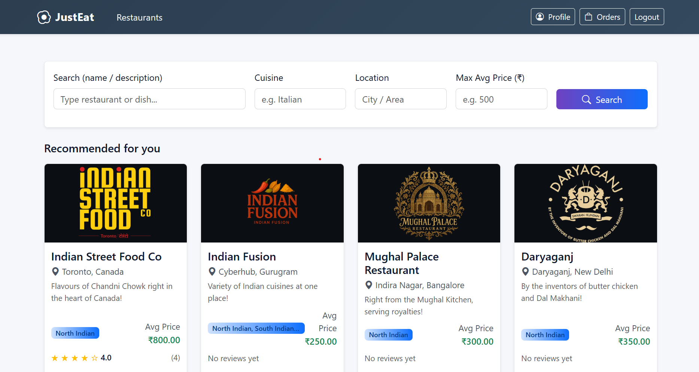
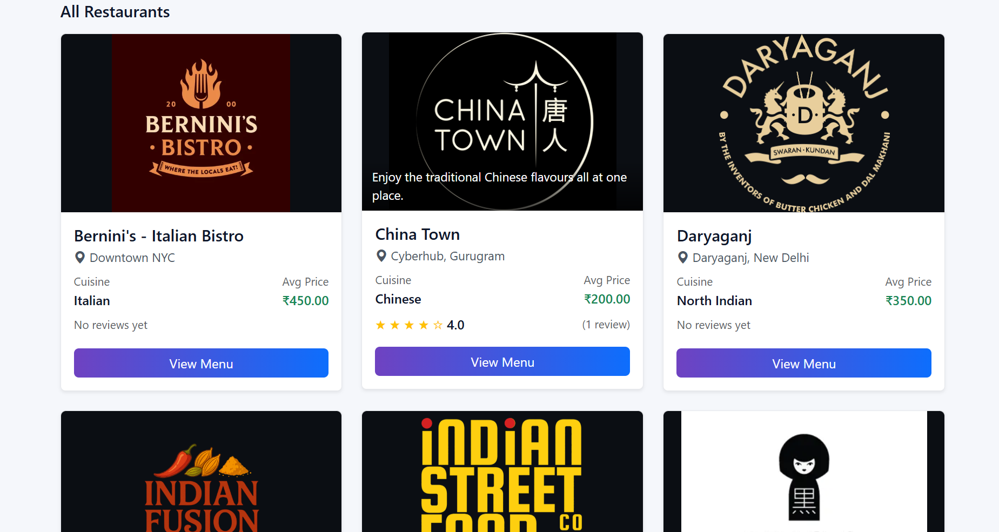

### 🛒 Menu & Cart with Dynamic Total and Quantity

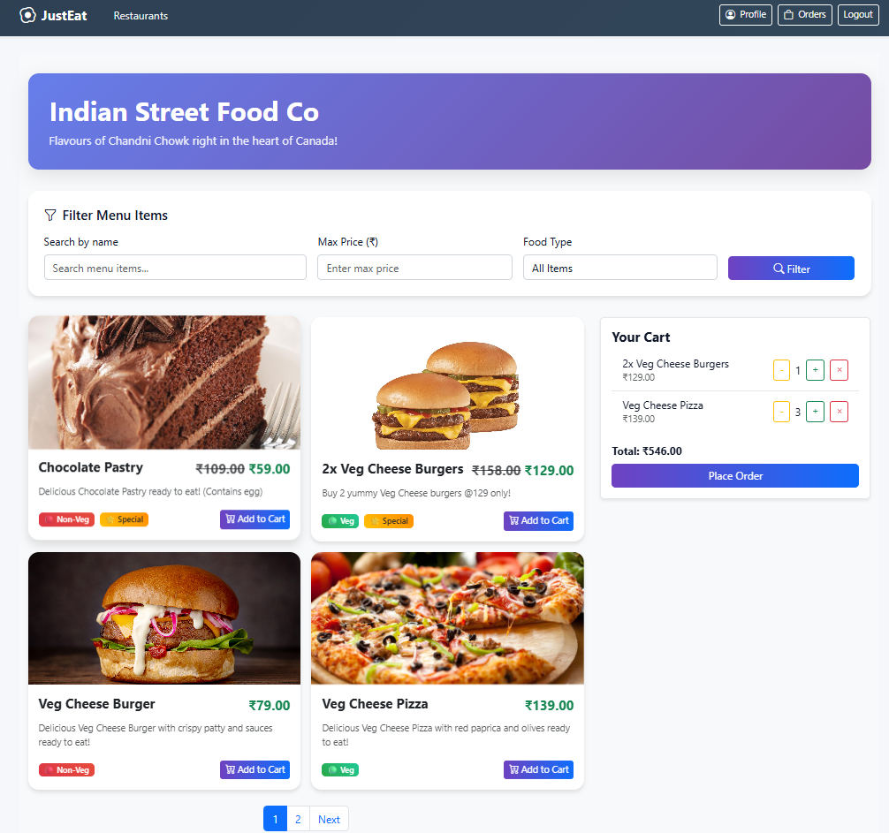

### 📦 Orders Page

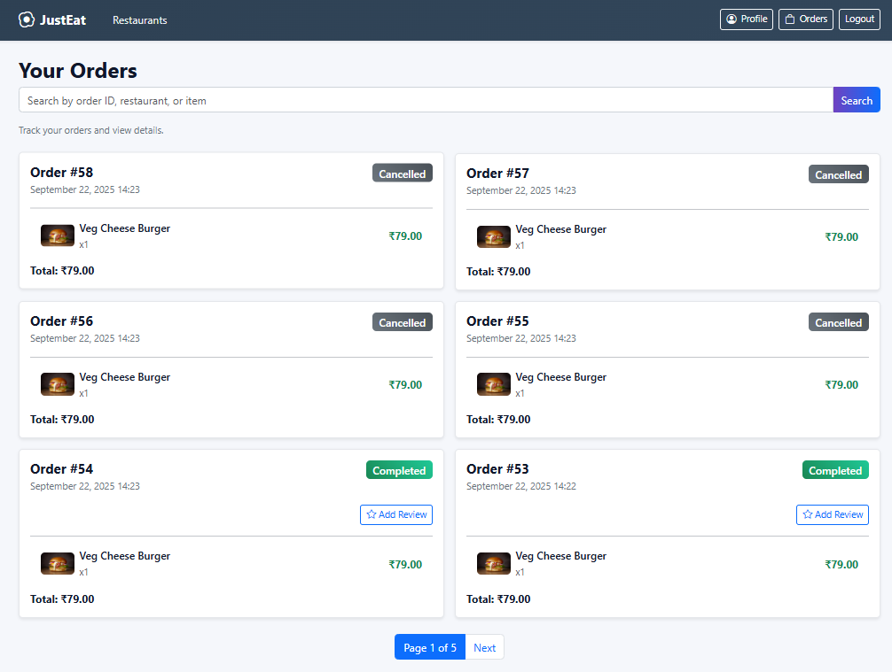

### 💬 Reviews & Feedback

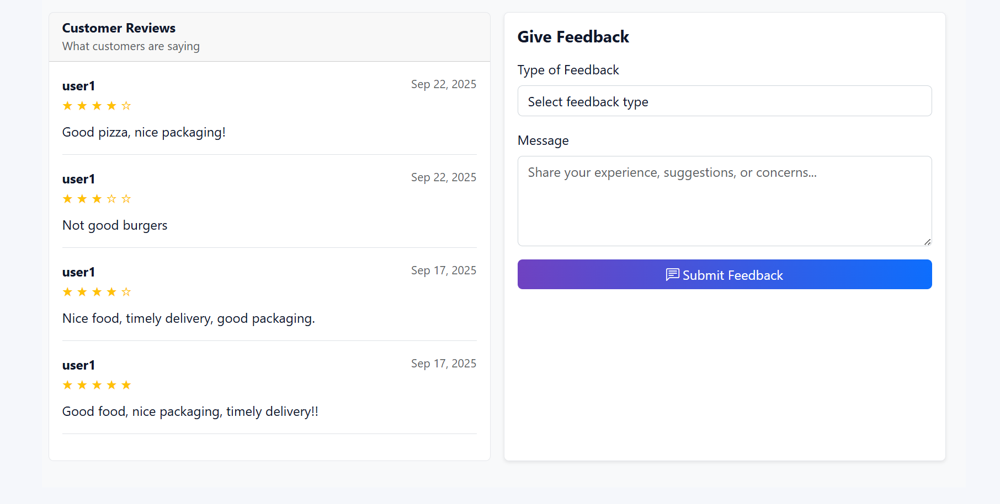

### 🧑‍💼 Customer Profile

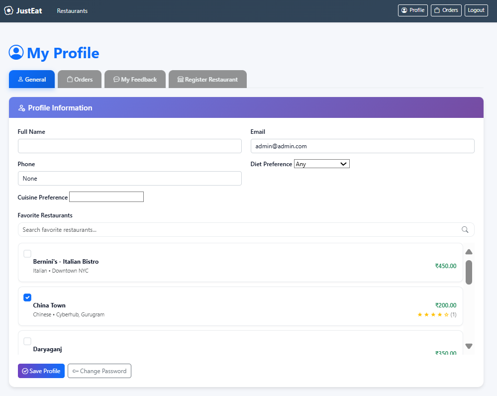
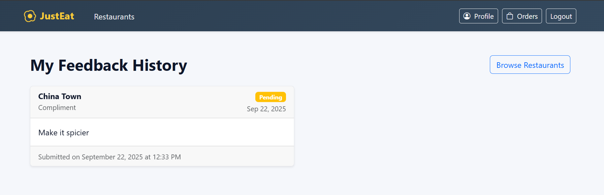
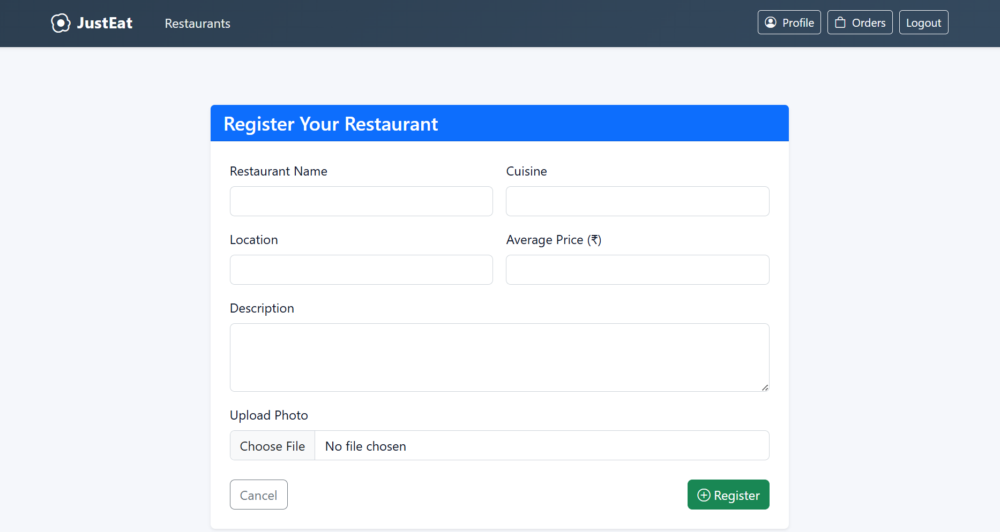


### 🧑‍💻 Owner Dashboard

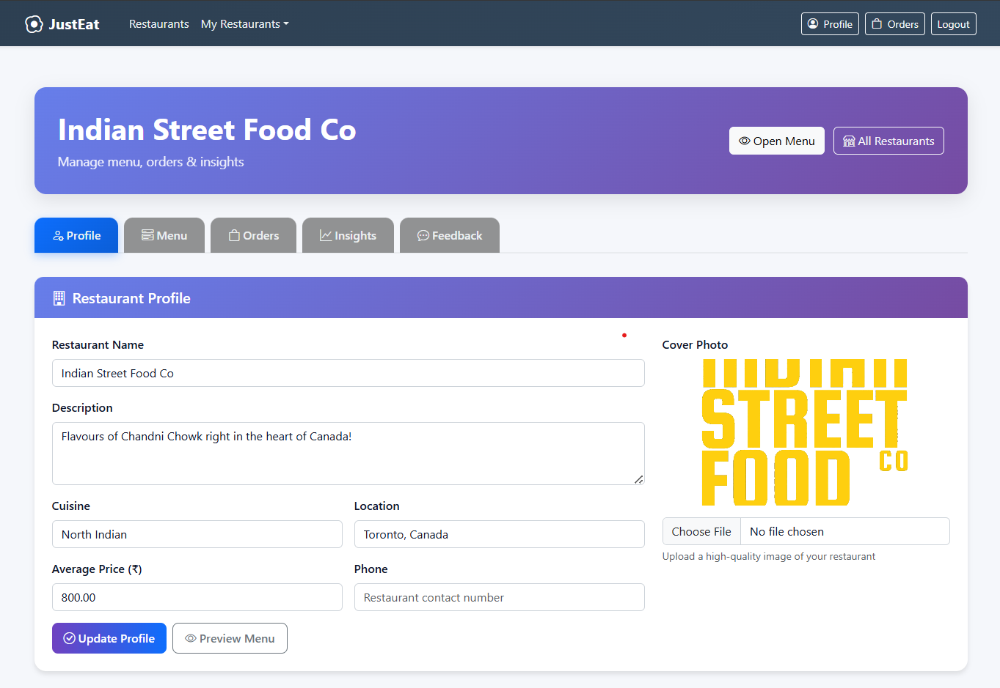
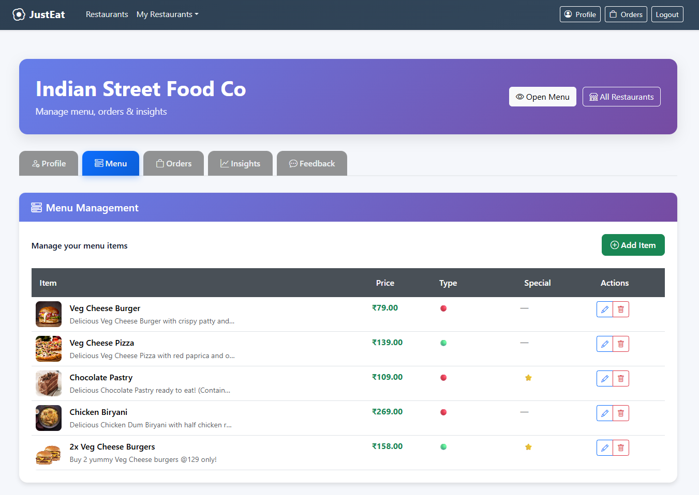
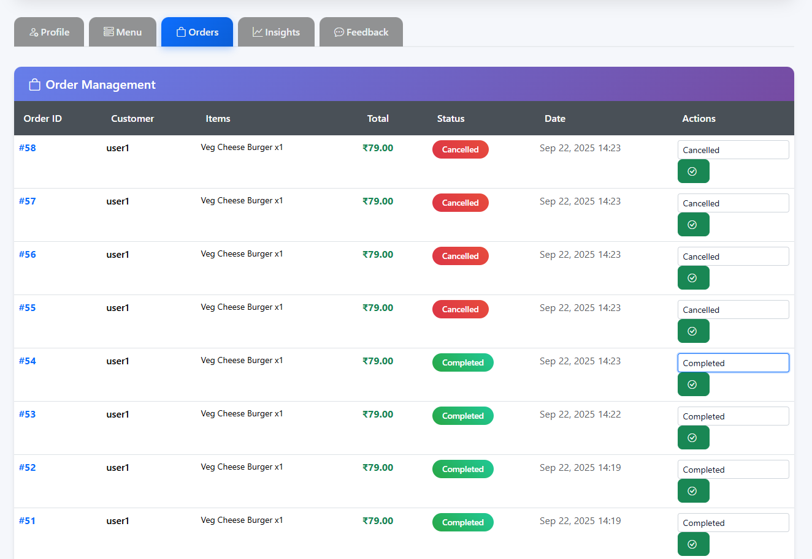
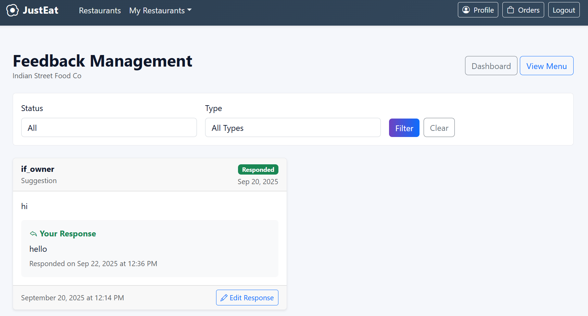

### 📊 Insights

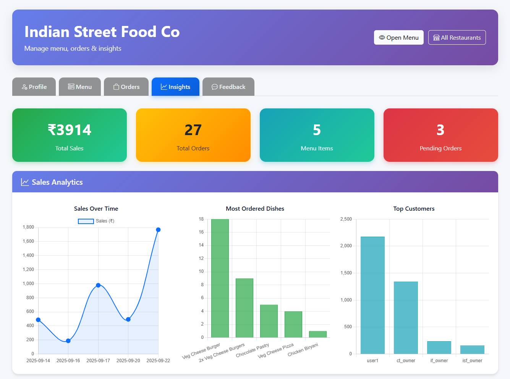

### 🔐 Login & Signup

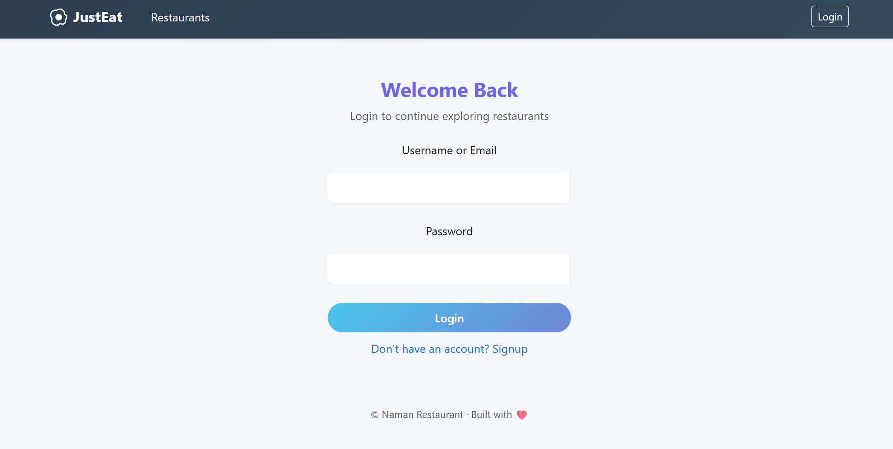

### 🛠️ Admin Panel

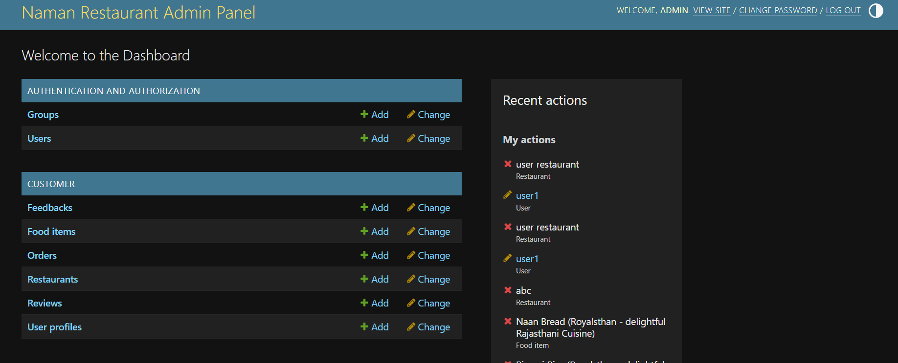

---

## 🧩 Tech Stack

| **Layer**          | **Technology**                               |
| ------------------ | -------------------------------------------- |
| Backend            | Python, Django                               |
| Frontend           | HTML5, CSS3, Bootstrap 5                     |
| Database           | SQLite3                                      |
| Charts & Analytics | Chart.js                                     |
| Templates          | Django Templating Engine                     |
| Authentication     | Django Auth (Login, Logout, Password Change) |

---

## ⚡ Installation Guide

### 1️⃣ Clone the Repository

```bash
git clone https://github.com/kukretinaman/NamanRestaurant.git
cd NamanRestaurant
```

### 2️⃣ Create and Activate a Virtual Environment

```bash
python -m venv venv
venv\Scripts\activate        # Windows
source venv/bin/activate     # Mac/Linux
```

### 3️⃣ Install Dependencies

```bash
pip install -r requirements.txt
```

### 4️⃣ Run Database Migrations

```bash
python manage.py makemigrations
python manage.py migrate
```

### 5️⃣ Create a Superuser (Admin)

```bash
python manage.py createsuperuser
```

### 6️⃣ Start the Server

```bash
python manage.py runserver
```

Now open your browser and visit:
👉 [http://127.0.0.1:8000/](http://127.0.0.1:8000/)

---
## 👨‍🍳 Default Credentials (for testing)

### User with no restaurant
```
Username: user1   
Password: user@12345
```

### Restaurant Owner
```
Username: isf_owner
Password: owner@123
```

### Admin (exclusive admin panel access)
👉 [http://127.0.0.1:8000/admin](http://127.0.0.1:8000/admin)
```
Username: admin
Password: admin@123
```

---

## 🧭 Project Structure

```
NamanRestaurant/
│
├── customer/
│   ├── views.py
│   ├── models.py
│   ├── urls.py
│   ├── forms.py
│
├── system/
│   ├── views.py
│   ├── urls.py
│   ├── models.py
│
├── templates/
│   ├── base.html
│   ├── login.html
│   ├── signup.html
│   ├── home.html
│   ├── system/
│   │   ├── owner_dashboard.html
│   │   ├── add_food_item.html
│   │   ├── edit_food_item.html
│   │   └── feedback_management.html
│   └── customer/
│       ├── restaurant_list.html
│       ├── menu.html
│       ├── cart.html
│       ├── profile.html
│       ├── orders.html
│       ├── password_change.html
│       └── feedback.html
│
├── static/
│   ├── css/
│   ├── js/
│   └── images/
│
├── manage.py
└── requirements.txt
```

---

## 💡 Future Enhancements

* Integration with payment gateways (Stripe / Razorpay)
* Push notifications for order status updates
* Loyalty points and customer rewards
* AI-driven restaurant recommendations

---

## 👤 Author

**Naman Kukreti**
💼 [LinkedIn](https://www.linkedin.com/in/kukretinaman) • 🧑‍💻 [GitHub](https://github.com/kukretinaman)

---

## 📜 License

Licensed under the **MIT License**.
See the [LICENSE](LICENSE) file for details.
