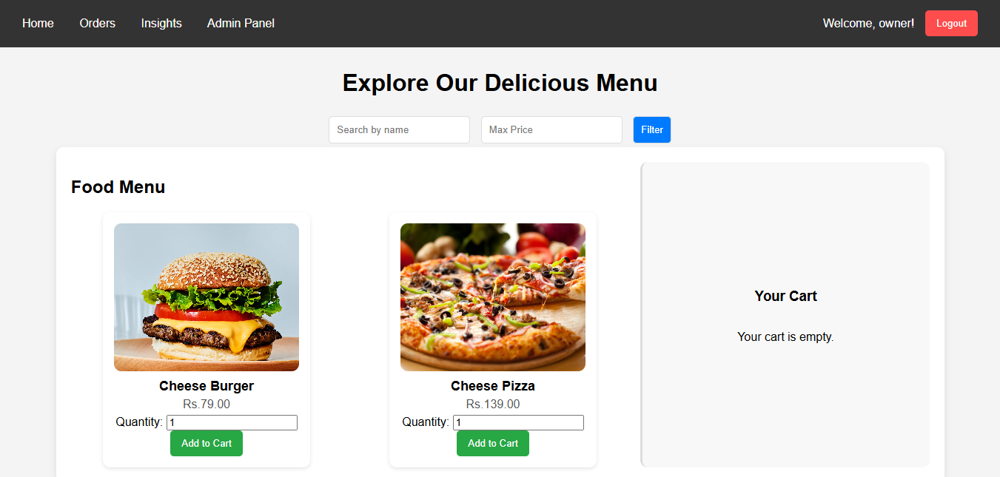
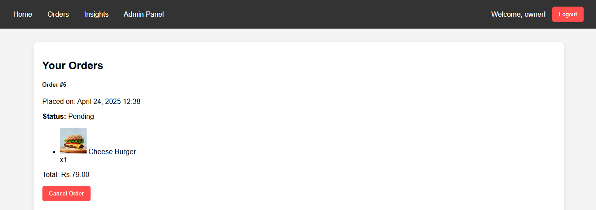
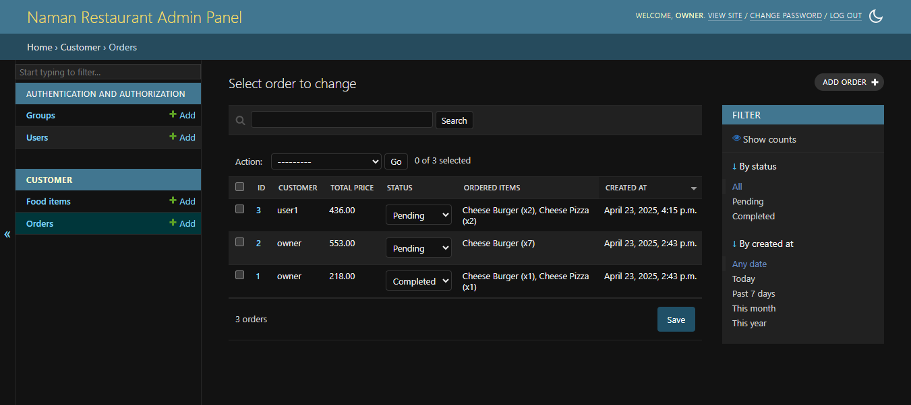
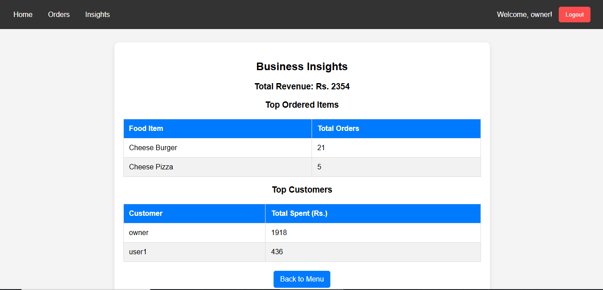
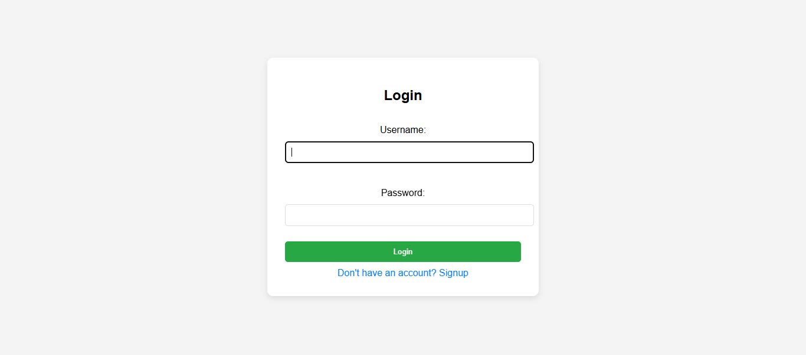
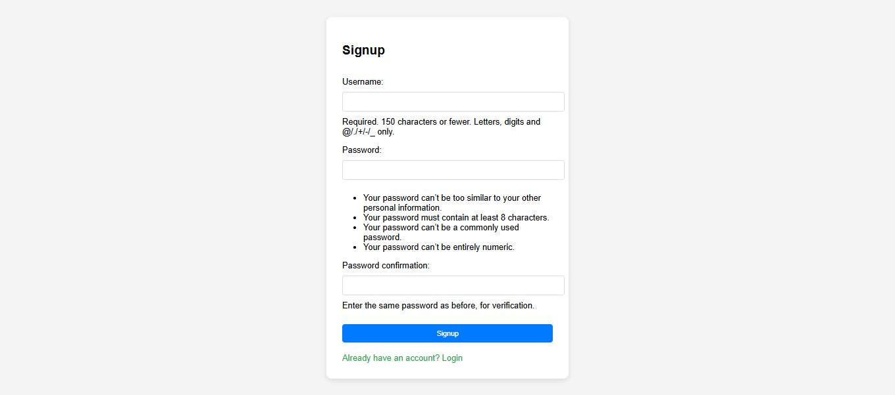

# Naman Restaurant - Restaurant Management Web App

A full-stack restaurant management system built using Django that enables customers to view the menu, place orders, track orders, and provides an admin panel for staff to manage food items and orders efficiently.

---

## Overview

This Restaurant Management Web App offers a modern and intuitive solution for restaurant operations. It allows customers to interact with the menu and place orders while also offering administrators the tools to manage orders and menu items from a centralized dashboard.

---

## Technologies Used

- **Python** – Backend language
- **Django** – Web framework
- **SQLite3** – Lightweight database
- **HTML/CSS** – Frontend design

---

## Features

### 👥 User Side:
- 🍕 View menu with dish images, prices, and descriptions
- 🛒 Add items to cart
- ✅ Place orders
- 📦 Track placed orders
- ❌ No access to admin panel and insights page

### Admin Side:
- 🔐 Admin login
- 📋 View all received orders
- ⏱️ Mark orders as completed
- 🍽️ Add new food items to the menu
- 🗑️ Delete or update food items
- 📈 Track order statuses (pending/completed)

---

## Screenshots

### 📜 Menu Page  


### 🧾 Order Tracking  


### 🔐 Admin Panel  


### 📊 Insights


### 🧑‍🍳 Login & Signup  
 


---

## 🚀 Getting Started

To run the project locally:

### 1️⃣ Clone the Repository

```bash
git clone https://github.com/kukretinaman/Restaurant-App.git
cd Restaurant-App
```

### 2️⃣ Create a Virtual Environment (Optional)

```bash
python -m venv venv
source venv/bin/activate  # For Unix/Linux
venv\Scripts\activate     # For Windows
```

### 3️⃣ Install Dependencies

```bash
pip install -r requirements.txt
```

### 4️⃣ Run Migrations

```bash
python manage.py makemigrations
python manage.py migrate
```

### 5️⃣ Create a Superuser (for admin access)

```bash
python manage.py createsuperuser
```

### 6️⃣ Start the Development Server

```bash
python manage.py runserver
```

Now visit: `http://127.0.0.1:8000/` in your browser and login through admin credentials or generate your own credentials using Signup button.

Admin Credentials:
- Username: owner
- Password: owner@123

---

## 👤 Contributor

- **Naman Kukreti**  
  [LinkedIn](https://www.linkedin.com/in/kukretinaman) • [GitHub](https://github.com/kukretinaman)

---

## 📄 License

This project is licensed under the MIT License. See the [LICENSE](LICENSE) file for more details.

---
